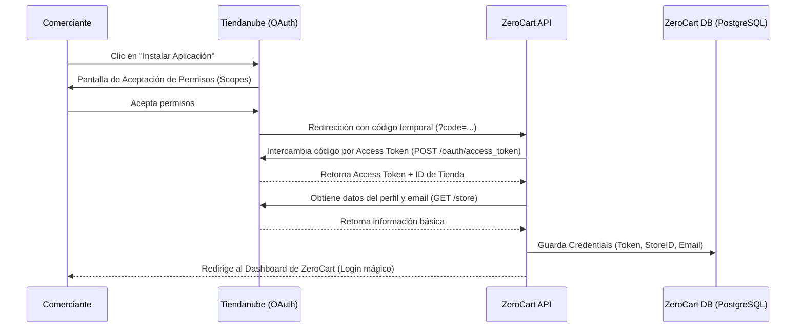
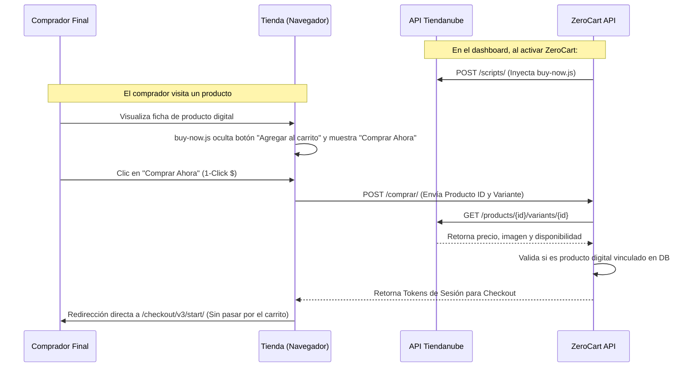
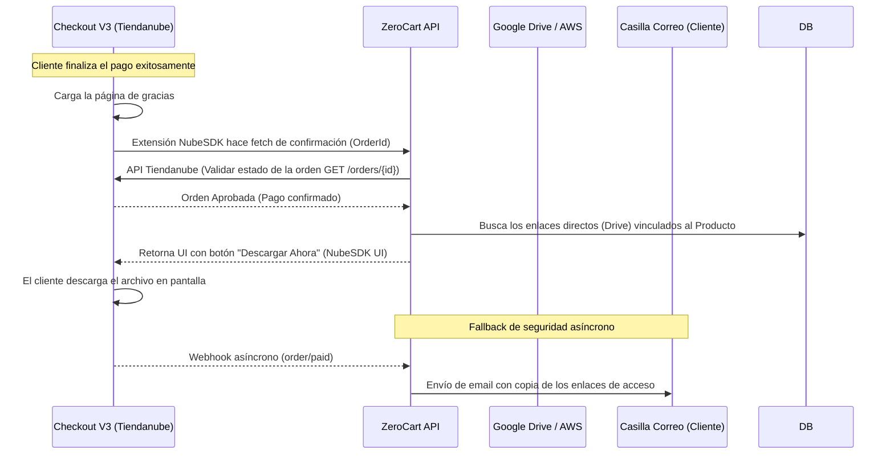

# Diagramas de Secuencia y Alcances (Scopes) - ZeroCart

Para cumplir con los requisitos de publicación de Tiendanube, a continuación se detallan los flujos técnicos principales de la aplicación ZeroCart. Estos diagramas justifican el uso de los alcances (*scopes*) obligatorios solicitados: `write_products`, `write_scripts`, `read_orders`, y `read_customers`.

---

## 1. Flujo de Instalación de la Aplicación (Autenticación OAuth)

Este flujo justifica la necesidad de acceso a los datos del comerciante y la capacidad de interactuar con la API en su nombre.

**Alcances Justificados aquí:**
- El acceso básico base de OAuth permite leer el perfil para crear la cuenta del usuario en nuestra base de datos sincronizada.

---

## 2. Flujo de Inyección de Script e Interacción del Botón (1-Click)

Este es el proceso *core* de la aplicación en el Frontend de la tienda. Justifica la necesidad de poder inyectar scripts y leer el catálogo de productos.

**Alcances Justificados aquí:**
- `write_scripts` / `read_scripts`: Obligatorio para poder inyectar `buy-now.js` asíncronamente en el portal del cliente sin requerir modificaciones manuales en su tema (theme).
- `read_products`: Necesario para que nuestro endpoint `/comprar/` pueda re-validar dinámicamente el precio real y las variantes del ítem digital antes de redirigirlo directamente al módulo de pago, evitando errores de carritos vacíos (Error 404).

---

## 3. Flujo de Página de Gracias (NubeSDK) y Entrega de Archivos

Este flujo explica cómo ZeroCart completa su promesa de valor entregando el producto una vez que el pago se efectúa.

**Alcances Justificados aquí:**
- `read_orders`: Fundamental para leer el estado del pago directamente en la Página de Gracias (Checkout V3 en Web Worker) y permitir/denegar el acceso al archivo en pantalla. También es requerido por nuestro sistema de Webhooks para activar el correo de respaldo (fallback).
- `read_customers`: Requerido extraer el correo del comprador final desde la Orden recién pagada para enviarle la copia de respaldo de sus enlaces de descarga, tal como se comprometió la aplicación.
